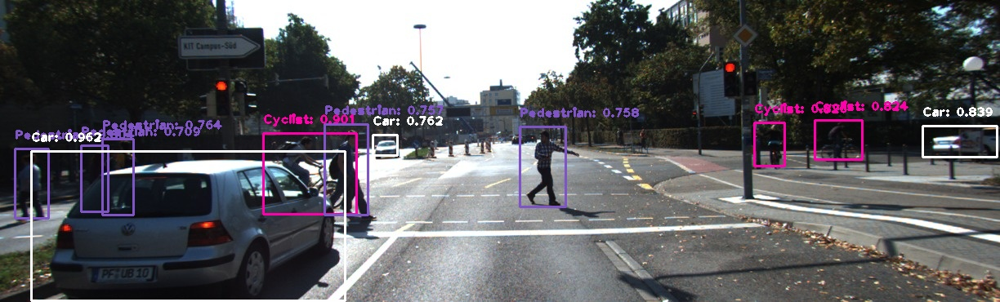

# YOLOv2 in PyTorch
This is a [PyTorch](https://github.com/pytorch/pytorch)
implementation of YOLOv2.
This project is forked from (https://github.com/longcw/yolo2-pytorch), but not compatible with origin version.

Currently, I train this model for [KITTI Dataset](http://www.cvlibs.net/datasets/kitti/) to demo. It predicts car, pedestrian and cyclist. If you want a general detecotr, please refer to [this](https://github.com/longcw/yolo2-pytorch).

You can also use [original YOLOv2](https://github.com/pjreddie/darknet) COCO model on KITTI, Here is a [demo video](
https://www.youtube.com/watch?v=mfB1C4QQJr4)

For details about YOLO and YOLOv2 please refer to their [project page](https://pjreddie.com/darknet/yolo/) 
and the [paper](https://arxiv.org/abs/1612.08242):
YOLO9000: Better, Faster, Stronger by Joseph Redmon and Ali Farhadi.

<p align="center">
  
</p>

### System Environment
+ Ubuntu 16.04
+ CUDA 8.0 / cuDNN 5.1
+ Python 3.5
+ Numpy 1.12
+ PyTorch 0.1.12
+ OpenCV 3.2

With a 1080Ti GPU, I get ~30 fps using this KITTI model (input size = 1216 x 352)

### Installation and demo
1. Clone this repository
    ```bash
    git clone git@github.com:cory8249/yolo2-pytorch.git
    ```

2. Build the reorg layer ([`tf.extract_image_patches`](https://www.tensorflow.org/api_docs/python/tf/extract_image_patches))
    ```bash
    cd yolo2-pytorch
    ./make.sh
    ```
3. Download the trained model [kitti_baseline_v3_100.h5](https://drive.google.com/file/d/0B3IzhcU-mEUsWnBIcW00aUsteTQ) 
and set the model path in `yolo_detect.py`
4. Run demo `python3 yolo_detect.py`. 

Install any missing packages manually via pip
